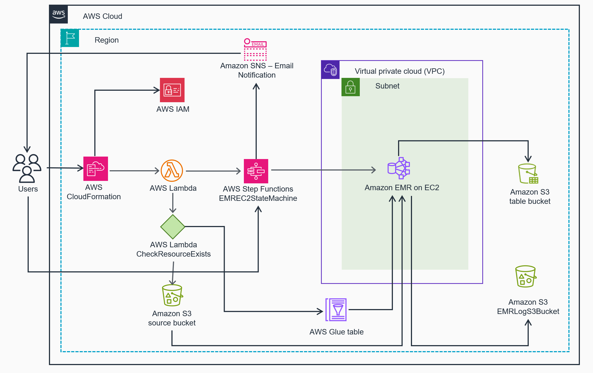
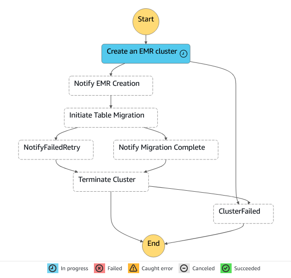

# Guidance for Migrating tabular data from Amazon S3 to S3 Tables

## Table of Contents
1. [Overview](#overview)
    - [Core Services](#core-services)
    - [Solution Overview](#solution-overview)
    - [Costs](#costs)
2. [Prerequisites](#prerequisites)
    - [Region](#region-suport)
    - [EMR Cluster Sizes](#emr-cluster-sizes)
3. [Deployment Steps](#deployment-steps)
4. [Deployment Validation](#deployment-validation)
5. [Running the Guidance](#running-the-guidance)
6. [Cleanup](#cleanup)
7. [Contact AWS Support](#contact-aws-support)
8. [Customer responsibility](#customer-responsibility)
9. [Feedback](#feedback)
10. [Notices](#notices)

---

<a name="overview"></a>
## Overview

This user guide is created for anyone who is interested in migrating tabular data from [Amazon S3](https://aws.amazon.com/s3/) general purpose buckets to [Amazon S3 Tables](https://aws.amazon.com/s3/features/tables/). Amazon S3 Tables are purpose-built for storing tables using the [Apache Iceberg](https://iceberg.apache.org/) format. S3 Tables introduce a new bucket type for Apache Iceberg tables that delivers up to 3x faster query performance and up to 10x higher transactions per second compared to storing Iceberg tables in general purpose Amazon S3 buckets. Table buckets allow you to create tables and configure table-level permissions through the [AWS Management Console](https://aws.amazon.com/console/).  With built-in support for Apache Iceberg, query tabular data in S3 with popular engines including [Amazon Athena](https://aws.amazon.com/athena/), [Amazon Redshift](https://aws.amazon.com/pm/redshift/), and [Apache Spark](https://spark.apache.org/). 

This solution sets up an automated migration process for moving tables registered in [AWS Glue Table Catalog](https://docs.aws.amazon.com/glue/latest/dg/tables-described.html) and stored in Amazon S3 general-purpose buckets to Amazon S3 Table buckets using [AWS Step Functions](https://aws.amazon.com/step-functions/), and [Amazon EMR](https://aws.amazon.com/emr/) with Apache Spark.

<a name="core-services"></a>
### Core Services
Below is a high-level overview of the core services that are incorporated into this solution. We will assume the reader is familiar with Git, Python, and AWS.

| Service | Description |
|---------|-------------|
| [AWS CloudFormation](https://aws.amazon.com/cloudformation/) | Speed up cloud provisioning with infrastructure as code. |
| [Amazon S3](https://aws.amazon.com/s3/) and [Amazon S3 Tables](https://aws.amazon.com/s3/features/tables/)  | S3 is an object storage service that offers industry-leading scalability, data availability, security, and performance. S3 Tables deliver the first cloud object store with built-in Apache Iceberg support and streamline storing tabular data at scale.|
| [AWS Lambda](https://aws.amazon.com/lambda/) | Serverless compute service that runs code in response to events and automatically manages the compute resources, enabling developers to build applications that scale with business needs. |
| [AWS Step Functions](https://aws.amazon.com/step-functions/) | Create workflows to build distributed applications, automate processes, orchestrate microservices, and create data and machine learning pipelines. |
| [Amazon Simple Notification Service](https://aws.amazon.com/pm/sns) | A managed service that provides message delivery from publishers to subscribers. |
| [Amazon Identity and Access Management](https://aws.amazon.com/iam) | Securely manage identities and access to AWS services and resources. |
| [Amazon EMR](https://aws.amazon.com/emr/) | Run and scale Apache Spark, Hive, Presto, and other big data workloads. |

---

<a name="solution-overview"></a>
### Solution Overview

This solution deploys an AWS Step Functions state machine to manage the migration workflow along with several other supporting AWS resources (AWS IAM roles, Amazon SNS topic, and an Amazon S3 bucket for EMR logs). In addition to the standard AWS resources, a [CloudFormation Custom Resource](https://docs.aws.amazon.com/AWSCloudFormation/latest/UserGuide/template-custom-resources.html), via AWS Lambda, is used to validate the existence of the source S3 bucket and AWS Glue Table. Once deployed, the user starts the EMREC2StateMachine workflow which in turn deploys an EMR cluster, starts an Apache Spark job execution on the deployed cluster, and deletes the cluster when the migration is completed. The Apache Spark job uses CTAS (Create Table as Select) to migrate the Iceberg data from the source S3 bucket to the target S3 table bucket. Throughout the migration process, the Step Function sends status notifications via SNS to the user.

Upon completion, the Step Function sends an email via SNS to the user that the workflow has completed, and the EMR Cluster is then terminated by the EMREC2StateMachine Step Function task.

 

<p align="center">
<em>Figure 1. Migrating tabular data from Amazon S3 to S3 Tables Reference Architecture.</em>
</p>

<p align="center">

</p>

<p align="center">
<em>Figure 2. AWS Step Functions Flow Chart.</em>
</p>

<a name="costs"></a>
### Costs

While this sample code is free to download and review, please be aware that you will incur costs for the AWS services or resources activated by this guidance architecture when the CloudFormation template is launched. The cost will vary based upon the amount of data that requires migration, number of objects, and the size of the EMR cluster creation.

In this cost example, we examine the cost over a month for a 1TiB S3 bucket migration with updates creating 1,000 new data files with an average object size of 5 MB and 3 metadata files with an average object size of 10 KB. The table users frequently perform queries on the data-set and generate 500,000 GET requests per month. To optimize query performance, automatic compaction is enabled. In addition we are including the cost of a Small EMR Cluster option, detailed below in deployment costs, for the duration of the migration.

### Example Costs

You are responsible for the cost of the AWS services used while running this solution. As of December 2024, the cost for running this solution with the small Implementation of EMR in US West-2 (US Oregon) Region is approximately **\$ 45.68 per month**, assuming **1 TiB of Data and 1,000 Objects are migrated**.

This guidance uses [Serverless services](https://aws.amazon.com/serverless/), which use a on-demand billing model - costs are incurred with usage of the deployed resources. Refer to the [Sample cost table](#sample-cost-table) for a service-by-service cost breakdown.

We recommend creating a [budget](https://alpha-docs-aws.amazon.com/awsaccountbilling/latest/aboutv2/budgets-create.html) through [AWS Cost Explorer](http://aws.amazon.com/aws-cost-management/aws-cost-explorer/) to help manage costs. Prices are subject to change. For full details, refer to the pricing webpage for each AWS service used in this guidance.

#### Sample cost table

The following table provides a sample cost breakdown for deploying this guidance with the default parameters in the `us-west-2` (US Oregon) Region for one month assuming "non-production" level volume of uploaded files.

| Cost Component                      | Calculation                                                | Cost     |
|----------------------------------------|------------------------------------------------------------|---------:|
| Free Tier Eligible | | | 
| - AWS Step Functions                      | 7 state transitions                    | $0.00    |
| - Amazon SNS                                 | 5 notifications                        | $0.00    |
| - AWS Lambda                              | Custom resource functions              | $0.00    |
| - Amazon IAM                                 | IAM roles and policies                               | $0.00    |
| Amazon EMR Cluster (3 hours)               |                                                            |          |
|-------------------------------------------|-----------------------------------------------------------|----------|
| - m5.4xlarge (Primary)                    | $0.768/hour * 3 hours                                     | $2.26    |
| - i3.4xlarge (Core)                       | $1.248/hour * 3 hours                                     | $3.74    |
| - i3.4xlarge (Task)                       | $1.248/hour * 3 hours                                     | $3.74    |
| - EMR Service Fee                         | $0.21/hour/instance * 3 instances * 3 hours              | $1.89    |
| Amazon S3 | | | 
| - S3 Tables Storage (Monthly)         | 1,024 GB * $0.0265/GB                                      | $27.14   |
| - S3 Tables PUT Requests              | 30,090 requests * $0.005/1,000 requests                    | $0.15    |
| - S3 Tables GET Requests              | 500,000 requests * $0.0004/1,000 requests                  | $0.20    |
| - S3 Tables Object Monitoring         | 10,486 objects * $0.025/1,000 objects                      | $0.26    |
| - S3 Tables Compaction (Objects)      | 30,000 objects * $0.004/1,000 objects                      | $0.12    |
| - S3 Tables Compaction (Data)         | 146.48 GB * $0.05/GB                                       | $7.32    |
| **Total Cost**                      |                                                            | **$46.30**|

### Assumptions and Notes:
- EMR Cluster runs for 3 hours for the migration job
- EC2 instance prices are based on US West-2 (US Oregon) region, On-Demand pricing
- EMR pricing includes EC2 instance cost plus a service fee
- S3 Tables costs are calculated on a monthly basis as per the previous scenario
- The total cost includes both the one-time migration cost (EMR) and the first month of S3 Tables usage
- Actual costs may vary based on region, specific data patterns, and any additional AWS services used

<a name="prerequisites"></a>

## Prerequisites

Before starting table migration, we strongly recommend to stop active write operations on the target table. This prevents data inconsistencies and loss of new updates during migration. Pause any applications, processes, or scheduled jobs that modify the table. Only proceed with migration after confirming all write operations have ceased to ensure data integrity. 

Before getting started with the migration process, ensure the following is in place:

1. **AWS Account**: An active [AWS account](https://aws.amazon.com/account/) to deploy the necessary resources and services.
2. **AWS CLI**: Ensure the [AWS Command Line Interface (CLI)](https://docs.aws.amazon.com/cli/latest/userguide/getting-started-install.html) is installed and configured on your local machine or development environment. The CLI will be used to initiate the CloudFormation deployment. Ensure credentials exist.
3. **git**: Install [git](https://git-scm.com/book/en/v2/Getting-Started-Installing-Git) to clone the sample code repository.
4. **Source Data**: Identify the existing Amazon S3 bucket and the Glue Data Catalog table that contains the tabular data to migrate.
    - If the source bucket is encrypted with [CMK-KMS](https://docs.aws.amazon.com/kms/latest/developerguide/concepts.html#customer-cmk), remember to grant the "EMREc2role" created by the CloudFormation template, in the Stack Output, access to the CMK-KMS key prior to running the migration.
    - This solution supports only Apache Iceberg source tables registered with AWS Glue Data Catalog.
5. **Destination S3 Tables**: Determine the Amazon S3 table bucket and namespace/database where tabular data will migrate.
6. **IAM Permissions**: Ensure you have the necessary IAM permissions to create and manage the required AWS resources, such as CloudFormation stacks, Amazon S3, AWS Glue, Amazon EMR, and AWS Step Functions.
    - If an [AWS Lake Formation](https://aws.amazon.com/lake-formation/) table is referenced, specific Lake Formation permissions (such as SELECT, DESCRIBE) on Glue databases and tables are granted.
7. **Email**: An active e-mail to subscribe to the Amazon SNS topic that will be used to receive migration status updates.
8. **S3 bucket for CloudFormation Template (optional for CLI)**: Due to the size of the CloudFormation template, using the AWS CLI requires a bucket to host the template.

Once you have these prerequisites in place, you can proceed with the deployment steps outlined in the guidance.

<a name="region"></a>
### Region Support
<i>Supported Regions for S3 Tables as of December 24st, 2024:</i>

| Region Name   | Region |
|--------|-----------------------------|
| US East (N. Virginia)  | us-east-1 | 
| US East (Ohio)  | us-east-2 | 
| US West (Oregon)  | us-west-2 | 

Current list of available Regions with S3 Tables support can be found [here](https://docs.aws.amazon.com/AmazonS3/latest/userguide/s3-tables-regions-quotas.html#s3-tables-regions).

<a name="emrsizes"></a>
### EMR Cluster Sizes

Provided below is the list of EMR Clusters that are deployable from the CloudFormation template. This decision is based off of the organization requirements.

| Size   | Primary Instance | Core Instances | Task Instances |
|--------|------------------|----------------|----------------|
| Small  | 1 x m5.4xlarge   | 1 x i3.4xlarge | 1 x i3.4xlarge |
| Medium | 1 x m5.4xlarge   | 4 x i3.4xlarge | 4 x i3.4xlarge |
| Large  | 1 x r5.4xlarge   | 4 x i3.4xlarge | 8 x i3.4xlarge |
| Xlarge | 1 x r5.4xlarge   | 8 x i3.4xlarge | 12 x i3.4xlarge |

Available Instance Classes for EMR based upon Size:

1. Small:
   - Primary: m5.4xlarge or m5d.4xlarge
   - Core and Task: i3.4xlarge or r5d.4xlarge

2. Medium:
   - Primary: m5.4xlarge or m5d.4xlarge
   - Core and Task: i3.4xlarge or r5d.4xlarge

3. Large:
   - Primary: r5.4xlarge or i3.4xlarge
   - Core and Task: i3.4xlarge or r5d.4xlarge

4. Xlarge:
   - Primary: r5.4xlarge or i3.4xlarge
   - Core and Task: i3.4xlarge or r5d.4xlarge

### Cluster Performance Configuration

| Size   | Executor Memory | Executor Cores | Driver Memory | Driver Cores | Max Executors |
|--------|-----------------|----------------|---------------|--------------|---------------|
| Small  | 24G             | 4              | 24G           | 4            | 7             |
| Medium | 24G             | 4              | 24G           | 4            | 29            |
| Large  | 24G             | 3              | 32G           | 4            | 44            |
| XLarge | 28G             | 4              | 48G           | 4            | 74            |

<a name="deployment-steps"></a>

## Deployment Steps

### Deployment Options

- Download the [CF Template](https://raw.githubusercontent.com/aws-solutions-library-samples/guidance-for-migration-of-iceberg-data-from-amazon-s3-to-amazon-s3-tables-on-aws/refs/heads/main/src/automated-migration-to-s3-tables-latest.yaml?token=GHSAT0AAAAAAC34ARM7CC6DW73L2K4DNRW4Z3ENHQA) to your local system, and launch via the [AWS Management CloudFormation Console](https://console.aws.amazon.com/cloudformation).
- Launch via [AWS CloudShell](https://aws.amazon.com/cloudshell/).
- Launch via the AWS CLI.
---

### Deployment Steps

#### AWS Management CloudFormation Console

1. 
    - Click on "Create stack" (with new resources).
    - Under "Specify template" select "Upload a template file"
        - Click "Choose file"
        - Upload the [CF Template](https://raw.githubusercontent.com/aws-solutions-library-samples/) downloaded to your local system.
    - Click "Next".
    - Specify stack details
        - Enter a stack name.
        - Fill in the parameters required.
        - Click "Next".
    - Configure stack options (optional):
        - Add tags
        - Set permissions
        - Configure advanced options (like rollback settings)
        - Click "Next".
    - Review your stack details and configuration.
        - At the bottom of the page, acknowledge that CloudFormation might create IAM resources (if applicable).
    - Click "Create stack".

#### AWS Cloud Shell and CLI
1. **Clone sample code GitHub repository using the following command:**
```
$ git clone https://github.com/aws-solutions-library-samples/guidance-for-migration-of-iceberg-data-from-amazon-s3-to-amazon-s3-tables-on-aws.git
Cloning into 'guidance-for-migrating-apache-iceberg-data-from-s3-to-s3-tables'...
remote: Enumerating objects: 29, done.
remote: Counting objects: 100% (29/29), done.
remote: Compressing objects: 100% (20/20), done.
remote: Total 29 (delta 10), reused 26 (delta 9), pack-reused 0 (from 0)
Receiving objects: 100% (29/29), 14.22 KiB | 2.84 MiB/s, done.
Resolving deltas: 100% (10/10), done.
```

2. **Change directory to the src subdirectory located at 'guidance-for-migrating-apache-iceberg-data-from-s3-to-s3-tables/src':**
```
cd guidance-for-migration-of-iceberg-data-from-amazon-s3-to-amazon-s3-tables-on-aws/src
```
3. **Define the following Parameters for CloudFormation**

Using your favorite text editor, update all relevant parameters in the parameters.json file.

```
$ ls
automated-migration-to-s3-tables-latest.yaml  parameters.json
$ vi parameters.json
```
#### Source Data
| Parameter | Description |
|-----------|-------------|
| `YourS3Bucket` | Source S3 bucket containing the data to migrate |
| `YourExistingGlueDatabase` | Source Glue database name |
| `YourExistingGlueTable` | Source Glue table name |

#### Destination
| Parameter | Description |
|-----------|-------------|
| `S3TableBucket` | Destination S3 table bucket ARN |
| `S3TableBucketNamespace` | Destination S3 table bucket namespace/database |
| `S3TableBucketTable` | Destination S3 table bucket name |
| `S3TableBucketTablePartitions` | Destination S3 table bucket partitions (OPTIONAL) |

#### Migration Configuration
| Parameter | Description |
|-----------|-------------|
| `MigrationType` | Type of migration (e.g., "New-Migration") |
| `ClusterSize` | Size of the EMR cluster (e.g., "Small", "Medium", "Large", "Xlarge") |

#### Network and Notification
| Parameter | Description |
|-----------|-------------|
| `subnetIDs` | List of subnet IDs (e.g., "subnet-12345678,subnet-87654321") |
| `KeyPair` | EC2 key pair for EMR primary node SSH access |
| `RecipientEmail` | Email address for job notifications |


> **Note**: Ensure all required parameters are correctly set before initiating the migration process.
---

4. **Add CloudFormation template to S3 bucket**

In the below example, replace **<SOME_BUCKET_NAME>** with the actual name of your S3 bucket.
```
aws s3 cp automated-migration-to-s3-tables-latest.yaml s3://<SOME_BUCKET_NAME>/cfn/automated-migration-to-s3-tables-latest.yaml
```
---
5. **Launch CloudFormation template from CLI:**

In the below example, replace **<SOME_BUCKET_NAME>** with the actual name of your S3 bucket, and <REGION> with the region the bucket is hosted.

```
aws cloudformation create-stack --stack-name s3TablesMigration --template-url http://<SOME_BUCKET_NAME>.s3.<REGION>.amazonaws.com/cfn/automated-migration-to-s3-tables-latest.yaml --parameters file://parameters.json --capabilities CAPABILITY_IAM
```
Upon successful launch of the CloudFormation stack, you will see output such as:
```
$ aws cloudformation create-stack --stack-name s3TablesMigration --template-url http://<SOME_BUCKET_NAME>.s3.<REGION>.amazonaws.com/cfn/automated-migration-to-s3-tables-latest.yaml --parameters file://parameters.json --capabilities CAPABILITY_IAM

{
    "StackId": "arn:aws:<SOME_BUCKET_NAME>:<REGION>:XXXXXXXXXXXX:stack/s3TablesMigration/XXXXXXXXX-YYYY-ZZZZ-AAAA-BBBBBBBBBBB"
}
```

## Deployment Validation

### 1. Confirm stack CREATE_COMPLETE

On the command line, run the following to determine if the Stack built successfully:
``` 
$ aws cloudformation describe-stacks --stack-name s3TablesMigration | jq -r .Stacks[].StackStatus
CREATE_COMPLETE
```

If the deployment fails, refer to [Troubleshooting a failed deployment](#troubleshooting-a-failed-deployment) for more information.

### 2. Confirm SNS Subscription
- Remember to confirm the SNS subscription to the e-mail address selected.

## Running the Guidance
### 1. Start Step Function Execution

### Log in to the AWS Management Console
- Open your web browser and go to https://console.aws.amazon.com/

### Navigate to AWS CloudFormation
- In the AWS Management Console, click on "Services" in the top-left corner
- In the search bar, type "CloudFormation" and select it from the drop-down

### Locate your stack
- In the CloudFormation dashboard, find and click on the name of your stack

### Access Stack Resources
- In the stack details page, click on the "Resources" tab
- Scroll through the list or use the search function to find "EMREC2StateMachine"
- Click on the link in the "Physical ID" column next to "EMREC2StateMachine"

### Start the Step Function Execution
- In the Step Function summary section, locate the "Start execution" button (usually in the top-right corner)
- Click "Start execution"
- In the "Start execution" dialog box, you can optionally provide input in JSON format
- Click "Start execution" to begin the workflow

### 2. Monitor the Process using the Step Function Console

#### Stay on the Step Functions execution page
- After starting the execution, you'll see a visual representation of your state machine
- Each step will update in real-time, showing its status (Running, Succeeded, Failed)
- Click on individual steps to see details, including input/output and any error messages

<p align="center">

</p>

<p align="center">
<em>Figure 3. AWS Step Functions Flow Chart - Creating an EMR Cluster.</em>
</p>

<p align="center">

</p>

<p align="center">
<em>Figure 4. AWS Step Functions Flow Chart - Initiate Table Migration.</em>
</p>

#### Check execution details

- On the right side of the page, you'll find the "Execution event history"
- This provides a chronological list of events in the execution
- Click on any event to see more details

### 3. Monitor the Process using the EMR Console

### Log in to the AWS Management Console
- Open your web browser and go to https://console.aws.amazon.com/

### Access the EMR for EC2 Cluster 
- In the search bar at the top, type "EMR" or find "EMR" under the list of services
- Click on "EMR" to open the Amazon EMR dashboard
- In the left navigation pane, click on "EMR on EC2"
- Click on "Clusters" in the sub-menu
- From the list of clusters, find and click on the cluster named "MigratetoS3Tables"

<p align="center">

</p>

<p align="center">
<em>Figure 5. AWS EMR Console - Monitoring Steps.</em>
</p>

<p align="center">

</p>

<p align="center">
<em>Figure 6. AWS EMR Console - Monitoring Spark Job.</em>
</p>

## Additional Monitoring Tips

### SNS Notifications
- Ensure you're subscribed to the SNS topic created for this process
- Check your email or preferred notification method regularly for updates

### CloudWatch Logs
- Consider setting up CloudWatch Logs for more detailed monitoring
- In the EMR console, go to "Cluster Settings" and enable "CloudWatch Logs integration"
<br></br>
**Remember** to keep the AWS Management Console open in a separate tab or window so you can easily switch between the Step Functions and EMR consoles as needed during the migration process.

## Post-migration transition guidance

After migration, please update all writer applications to use the new table in table buckets. We strongly recommend testing each application to confirm successful writes to the new table and gradually restarting operations, monitoring closely for any issues. You can keep the old table in read-only mode temporarily as a backup while verifying full functionality of the new setup.

<a name="Cleanup"></a>
## Cleanup
In order to un-deploy the guidance code from your AWS account, the following steps have to be made:

#### AWS Management CloudFormation Console

- Through the AWS Management Console, navigate to CloudFormation in the AWS Management Console, Select the stack as named during the deployment, and select Delete.

#### AWS Cloud Shell and CLI

- Through the AWS Console execute the following command:
```
aws cloudformation delete-stack --stack-name s3TablesMigration
```
Or if you have named the stack something else, replace "s3TablesMigration" with that stack name.

**Once deleted, the resources associated with the migration solution are no longer available, but the S3 Tables data and the EMR Logs S3 bucket are retained.**

---

<a name="troubleshootCF"></a>
## Troubleshooting CloudFormation
### Troubleshooting a Failed Deployment

If the stack status is not CREATE_COMPLETE, follow these steps to troubleshoot using standard free AWS tools:

1. **Check Stack Events:**

```
aws cloudformation describe-stack-events --stack-name s3TablesMigration
```
This command lists all resources in the stack, showing their status and any reasons for failure.

2. **View Stack Resources:**

```
aws cloudformation list-stack-resources --stack-name s3TablesMigration
```
This command lists all resources in the stack, showing their status and any reasons for failure.

3. Additional items to check:
    - **CloudWatch Logs**
    - **IAM Role**
    - **S3 Bucket Access**
    - **CloudTrail Logs**

## Contact AWS Support
If you have [AWS Developer Support](https://aws.amazon.com/premiumsupport/plans/developers/), [AWS Business Support](https://aws.amazon.com/premiumsupport/plans/business/), or [AWS Enterprise Support](https://aws.amazon.com/premiumsupport/plans/enterprise/), you can use the Support Center to get expert assistance with this solution. The following sections provide instructions.

Create case
1.	Sign in to [Support Center](https://support.console.aws.amazon.com/support/home#/).
2.	Choose **Create case**.

How can we help?
1.	Choose **Technical**.
2.	For **Service**, select **Solutions**.
3.	For **Category**, select **Other Solutions**.
4.	For **Severity**, select the option that best matches your use case.
5.	When you enter the **Service, Category**, and **Severity**, the interface populates links to common troubleshooting questions. If you can’t resolve your question with these links, choose **Next step: Additional information.**

Additional information
1.	For **Subject**, enter text summarizing your question or issue.
2.	For **Description**, describe the issue in detail.
3.	Choose **Attach files**.
4.	Attach the information that AWS Support needs to process the request.

Help us resolve your case faster
1.	Enter the requested information.
2.	Choose **Next step: Solve now or contact us.**

Solve now or contact us
1.	Review the **Solve now** solutions.
2.	If you can’t resolve your issue with these solutions, choose **Contact us**, enter the requested information, and choose **Submit**.

<a name="customer-responsibility"></a>
## Customer Responsibility
Upon deploying the guidance, ensure that all your resources and services are up-to-date and appropriately configured. This includes the application of necessary patches to align with your security requirements and other specifications. For a comprehensive understanding of the roles and responsibilities in maintaining security, please consult the [AWS Shared Responsibility Model](https://aws.amazon.com/compliance/shared-responsibility-model).

---
<a name="feedback"></a>
## Feedback

To submit feature ideas and report bugs, use the [Issues section of the GitHub repository](https://github.com/aws-solutions-library-samples/guidance-for-migrating-apache-iceberg-data-from-s3-to-s3-tables/issues) for this guidance.

---
<a name="notices"></a>
## Notices

This document is provided for informational purposes only. It represents current AWS product offerings and practices as of the date of issue of this document, which are subject to change without notice. Customers are responsible for making their own independent assessment of the information in this document and any use of AWS products or services, each of which is provided "as is" without warranty of any kind, whether expressed or implied. This document does not create any warranties, representations, contractual commitments, conditions, or assurances from AWS, its affiliates, suppliers, or licensors. The responsibilities and liabilities of AWS to its customers are controlled by AWS agreements, and this document is not part of, nor does it modify, any agreement between AWS and its customers.

The software included with this guidance is licensed under the MIT License, version 2.0 (the "License"). ermission is hereby granted, free of charge, to any person obtaining a copy of this software and associated documentation files (the "Software"), to deal
in the Software without restriction, including without limitation the rights to use, copy, modify, merge, publish, distribute, sublicense, and/or sell copies of the Software, and to permit persons to whom the Software is furnished to do so, subject to the following conditions:

The above copyright notice and this permission notice shall be included in all copies or substantial portions of the Software.

THE SOFTWARE IS PROVIDED "AS IS", WITHOUT WARRANTY OF ANY KIND, EXPRESS OR
IMPLIED, INCLUDING BUT NOT LIMITED TO THE WARRANTIES OF MERCHANTABILITY,
FITNESS FOR A PARTICULAR PURPOSE AND NONINFRINGEMENT. IN NO EVENT SHALL THE
AUTHORS OR COPYRIGHT HOLDERS BE LIABLE FOR ANY CLAIM, DAMAGES OR OTHER
LIABILITY, WHETHER IN AN ACTION OF CONTRACT, TORT OR OTHERWISE, ARISING FROM,
OUT OF OR IN CONNECTION WITH THE SOFTWARE OR THE USE OR OTHER DEALINGS IN THE
SOFTWARE.

---
